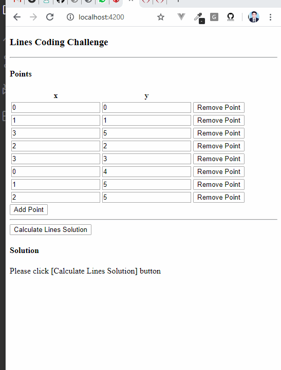

# Lines Coding Challenge
Given: A list of 2D (all different) points: (x_1, y_1), ..., (x_K, y_K); numbers use floating point representation.

As known from basic geometry, one can draw a straight line between any two such points. The goal is to find all _lines_ that have more than two points on them from the input set.

You can choose any way to represent a line, but the common one is y = m * x + b.

For example, if the input is (0, 0), (1,1), (3,5), (2,2), the output should be

(m=1, b=0) because this line has three points from the input set: (0, 0), (1,1), (2,2).

## Demo

## Lines Calculation Code
Lines calculation code is in this file:
https://github.com/Muhammadinaam/lines_coding_challenge/blob/master/src/app/classes/LinesCalculator.ts

## Time Complexity of Lines Calculation Code
Code is using two nested loops. In Outer loop, code takes first two points (from current loop index of outer loop) and calculate Line from these two points. Then it is checked (in inner loop) that whether point 3, 4, ... exist on this line or not. Time complexity of code is Big O(n^2).

## How to Setup and Run this project
This is angular project created with angular-cli. Clone the repo. then in repo folder run command "npm install" and then run "ng serve". Then open http://localhost:4200

